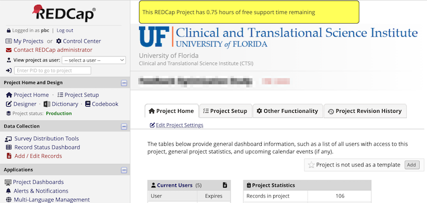

```{r, include = FALSE}
knitr::opts_chunk$set(
  collapse = TRUE,
  comment = "#>"
)
```

```{r setup, echo = FALSE}
library(rcc.billing)
```

## Background

CTS-IT has had a long-standing policy of not charging for initial consultations. Typically these consultations are limited to an hour. Any work beyond that could be billed, but it often wasn't due to the overhead of billing and comparatively small number of hours logged. The hours were made smaller by a policy of billing to the 1/4 hour. More billing disincentives arose because the work logged against one project often spans multiple support requests. It was quite hard to know if we were allowed to bill a small amount of work so we almost never billed anything.

The support billing component of REDCap automated billing was designed to manage that complexity at low cost so billing for 30 minutes work is economic and justifiable. 

## Support request system

CTS-IT's REDCap support request system is a REDCap project with one survey for request intake and one repeating form for logging responses. The system has existed since Fall 2014. It required several small modifications to be useful as a billed service, but the changes were straight-forward because it was built on REDCap forms. Data access and updates are also easy because we use the REDCap API to do both. 

## Pro bono work and the free consultation

Managing the free consultation required some way of making the billable rate vary. We did that by making the rate a categorical field three choices--the current billable rate, the old billable rate, and \$0/hour. The rate defaults to the current rate so new response records are all billable by default. REDCap staffers responding to a request can leave the rate as-is or they can select the \$0/hour if they believe the work should be pro bono. That could occur if the work was executed wrong on the first attempt and required rework. 

The billing system has a scheduled script, [update_probono_service_request_records.R](update_probono_service_request_records.html) that runs repeatedly during business hours to determine which projects have logged hours that should receive hourly rate adjustment down to \$0/hour. If a project already has an hour or more of logged at \$0/hr, it will not change anything. The script does not distinguish between hours it marked as pro bono and hours a human marked pro bono. 

## Communicating free support time remaining

Our customers need to know if they have free support time remaining. CTS-IT communicates that to their customers using the [data_driven_project_banner](https://github.com/ctsit/data_driven_project_banner) a REDCap External module that can present a banner if a database query returns a record and then build that banner from that query result. In this way the customers see when the have started using their free support time and when it has run out. To make this data available to [data_driven_project_banner](https://github.com/ctsit/data_driven_project_banner), the billing system has a scheduled script, [update_free_support_time_remaining.R](update_free_support_time_remaining.html) that runs repeatedly during business hours to copy summary data about the pro bono hours to a table, `free_support_time_remaining` in the REDCap database.

The resulting banner looks like this:


The billing policy is also communicated every time someone submits a support request with this reminder:

```
Fee-based services ($130/hour):
- Any assistance over the one-hour of free time PER PROJECT (PID).
- Assistance with data transformations and data imports.
- Project building/configuration services.
- Assistance with configuring External Modules.
- Assistance/help with using the API.

Free services:
- 1 hour of user support per project ID (PID).
- Account unsuspensions.
- Quotes for grant applications.
- Project un-sequestration.
```

## Expanding the scope of support billing

Historically, REDCap project build work has been logged in an Atlassian Jira system. It's very easy to log time in that system, but getting the data out would require yet another interface and related data transformations to make that data conform to the REDCap Automated Billing system. To save that effort, the REDCap project build work moved from Jira to the REDCap support request system the very first month the automated billing system started managing support requests. This will reduce the labor of generating invoices from manual exports of data from the JIRA system. Other projects will follow suit in the 3rd month of implementation.
