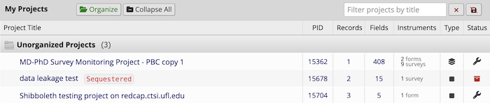

```{r, include = FALSE}
knitr::opts_chunk$set(
  collapse = TRUE,
  comment = "#>"
)
```

```{r setup, echo = FALSE}
library(rcc.billing)
```

The REDCap Automated Billing project requires novel concepts to decide how to manage a project's lifecycle, and who to bill for what. These concepts extend REDCap or modifies its behavior to suit the needs of the billing workflows. 

## Sequestration

Project sequestration is a novel project lifecycle stage for orphaned and unpaid projects. It's a step on the path to project deletion. Sequestration co-opts REDCap's *completed projects* concept rebranding it via a few UI changes provided by the [project_sequestration_ui_hack](https://github.com/ctsit/project_sequestration_ui_hack), a REDCap external module created just for this purpose. A sequestered module will appear like this in the REDCap's My Projects page:



## Extending the deleted project life

Deleting abandoned projects is a valuable component of the billing system. It reduces the amount of sensitive and restricted data on the REDCap system to only what’s needed. It removes data from the system that might be poorly described yet without an owner to attest to its provenance or purpose. Yet it can be hard to distinguish an abandoned project from one owned by someone ignoring their email. To mitigate the risk of deleting something of value, the automated deletion tasks take a conservative approach that is easy to reverse until the moment of project deletion. As part of the risk mitigation, the UF REDCap system uses a patch to the REDCap core code, [set_project_deletion_time](https://github.com/ctsit/set_project_deletion_time). It extends the time between a deletion request and the actual deletion event when data is purged to 365 days. REDCap projects are straightforward to undelete before the purge event occurs, yet quite difficult to recover immediately after the purge event. The additional 11 months before the data purge provides a valuable safety buffer.
